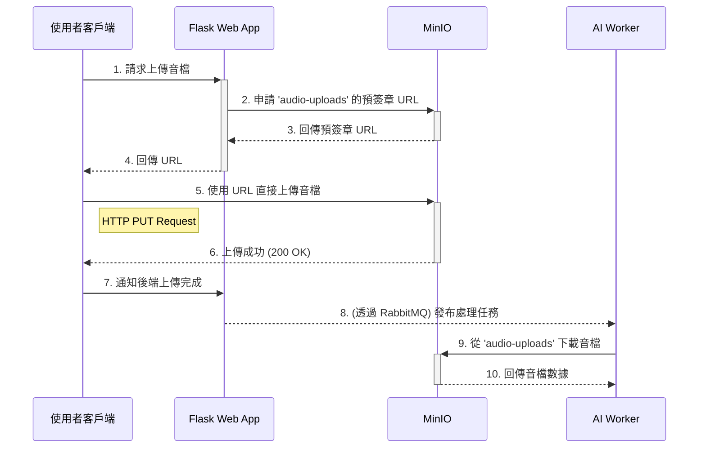

# MinIO 技術文件

本文檔旨在詳細闡述 MinIO 物件儲存服務在「Beloved Grandson」專案中的系統定位、核心功能、整合方式與設計考量。

## 1. 系統定位與核心角色

在整體架構中，MinIO 扮演著**統一的、S3 相容的物件儲存中樞**角色。其核心定位是為系統中所有非結構化數據（尤其是二進位檔案）提供一個集中、可擴展且與雲端儲存協議兼容的持久化解決方案。

MinIO 的引入實現了以下關鍵目標：
- **服務解耦**：將檔案的儲存與處理邏輯分離。AI 服務（如 STT、TTS）無需關心底層檔案系統，只需透過標準的 S3 API 與 MinIO 互動。
- **數據集中化**：所有由使用者上傳或系統生成的檔案都統一存放在 MinIO，簡化了數據管理、備份與遷移的複雜性。
- **高效檔案傳輸**：透過預簽章 URL (Pre-signed URL) 機制，允許客戶端直接將檔案上傳至 MinIO，繞過了應用伺服器 (`web-app`)，大幅降低了後端服務的網路負載與處理壓力。

## 2. 核心功能與儲存桶 (Bucket) 策略

MinIO 主要負責儲存兩大類核心數據，並透過不同的儲存桶 (Bucket) 進行隔離與管理：

| Bucket 名稱 | 數據內容 | 產生者 | 消費者 | 描述 |
| :--- | :--- | :--- | :--- | :--- |
| `audio-uploads` | 使用者上傳的原始音檔 | 使用者客戶端 | `ai-worker` -> `stt-service` | 存放使用者透過預簽章 URL 上傳的語音訊息，作為 AI 處理鏈的起點。 |
| `milvus-data` | Milvus 的向量與索引檔案 | `milvus` / 離線腳本 | `milvus` | 存放由 Milvus 自身管理的向量數據、索引及元數據，是 RAG 功能的底層數據基礎。 |
| (隱含) `tts-audio` | TTS 服務生成的音檔 | `ai-worker` -> `tts-service` | 使用者客戶端 | 雖然未在文件中明確命名，但 TTS 服務生成的音檔也由 MinIO 儲存，供使用者播放。 |

## 3. 與其他服務的整合與數據流

MinIO 是數據流轉的關鍵節點，與多個核心服務緊密互動。

### 3.1. 語音上傳流程 (STT)

1.  **授權**：`web-app` 作為閘道，向 MinIO 請求一個針對 `audio-uploads` bucket 的有時效性**預簽章上傳 URL**。
2.  **上傳**：使用者客戶端（瀏覽器/App）使用此 URL，透過 HTTP PUT 請求將音檔**直接上傳**至 MinIO。
3.  **消費**：`ai-worker` 在收到任務後，使用 S3 SDK 從 `audio-uploads` bucket **下載**指定的音檔，並傳遞給 `stt-service` 進行處理。

### 3.2. RAG 向量數據儲存 (Milvus)

-   **底層依賴**：Milvus 服務被配置為使用 MinIO 作為其底層的儲存後端 (Storage Backend)。
-   **數據流**：當 RAG 的離線腳本將向量化數據寫入 Milvus 時，Milvus 會將這些向量分塊 (chunks) 和相關的索引檔案序列化，並儲存到 `milvus-data` bucket 中。同樣，當 `llm-service` 查詢 Milvus 時，Milvus 會從 MinIO 中讀取相應的數據檔案進行運算。

## 4. 設計考量與管理

-   **S3 相容性**：選擇 MinIO 的主要原因之一是其與 Amazon S3 API 的完全相容性。這使得開發團隊可以使用成熟穩定、生態豐富的 S3 SDK 進行開發，同時也為未來將儲存遷移至公有雲（如 AWS S3）保留了可能性。
-   **私有化部署**：作為一個自託管 (Self-hosted) 的解決方案，MinIO 讓所有數據都能儲存在本地基礎設施內，確保了數據的隱私與主權。
-   **管理**：可透過 MinIO 內建的 Web Console (`http://<minio-host>:9001`) 進行儲存桶管理、權限設定與檔案瀏覽，方便開發與維運。存取金鑰通常透過環境變數 (`MINIO_ROOT_USER`, `MINIO_ROOT_PASSWORD`) 注入到 `docker-compose.yml` 中。
