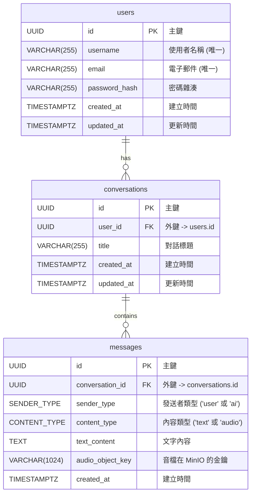

# PostgreSQL 資料庫設計 - Beloved Grandson

## 1. 總覽與設計理念

本文件基於專案的架構文件、架構圖及現有的 MongoDB 設計，提供一份詳盡的 PostgreSQL 資料庫設計方案。

在「Beloved Grandson」專案中，PostgreSQL 的核心職責是儲存**結構化的核心業務資料**，主要包括使用者資訊、對話的元資料以及對話中的每一則訊息。相較於 MongoDB 將整場對話儲存在單一文件中的作法，關聯式設計將資料正規化 (Normalize) 到不同的資料表中，以確保資料的完整性、一致性，並利用外鍵來維護實體間的關係。

此設計的核心理念是：
-   **資料完整性**: 透過主鍵、外鍵和 NOT NULL 約束，確保資料的準確性和一致性。
-   **正規化**: 將資料拆分為 `users`, `conversations`, `messages` 三個主要的資料表，減少資料冗餘。
-   **可擴展性**: 清晰的結構有利於未來的功能擴展和維護。

## 2. 資料表關係 (ERD - Entity Relationship Diagram)



-   一個 `user` 可以擁有多個 (`one-to-many`) `conversations`。
-   一個 `conversation` 包含多則 (`one-to-many`) `messages`。

## 3. 自訂資料型態 (Custom Types)

為了提高資料一致性，我們定義了兩個 `ENUM` 型態。

```sql
CREATE TYPE SENDER_TYPE AS ENUM ('user', 'ai');
CREATE TYPE CONTENT_TYPE AS ENUM ('text', 'audio');
```

## 4. 資料表定義

### 4.1. `users`

儲存使用者的核心帳號資訊。

| 欄位名稱 | 資料型態 | 主鍵/外鍵 | 索引 | 說明 |
| :--- | :--- | :--- | :--- | :--- |
| `id` | `UUID` | `PRIMARY KEY` | 自動 | 使用者的唯一識別碼，建議使用 UUID 以利於分散式系統。 |
| `username` | `VARCHAR(255)` | | `UNIQUE` | 使用者名稱，必須唯一。 |
| `email` | `VARCHAR(255)` | | `UNIQUE` | 使用者電子郵件，必須唯一，用於登入或通知。 |
| `password_hash`| `VARCHAR(255)` | | | 儲存經雜湊處理後的密碼。 |
| `created_at` | `TIMESTAMPTZ` | | | 帳號建立時間 (包含時區)。 |
| `updated_at` | `TIMESTAMPTZ` | | | 帳號最後更新時間 (包含時區)。 |

### 4.2. `conversations`

儲存每一場對話的元資料。

| 欄位名稱 | 資料型態 | 主鍵/外鍵 | 索引 | 說明 |
| :--- | :--- | :--- | :--- | :--- |
| `id` | `UUID` | `PRIMARY KEY` | 自動 | 對話的唯一識別碼。 |
| `user_id` | `UUID` | `FOREIGN KEY (users.id)` | `INDEX` | 關聯至 `users` 表，標示此對話屬於哪個使用者。 |
| `title` | `VARCHAR(255)` | | | 對話的標題。 |
| `created_at` | `TIMESTAMPTZ` | | | 對話建立時間。 |
| `updated_at` | `TIMESTAMPTZ` | | `INDEX` | 對話最後更新時間，用於排序。 |

### 4.3. `messages`

儲存對話中的每一則訊息。

| 欄位名稱 | 資料型態 | 主鍵/外鍵 | 索引 | 說明 |
| :--- | :--- | :--- | :--- | :--- |
| `id` | `UUID` | `PRIMARY KEY` | 自動 | 訊息的唯一識別碼。 |
| `conversation_id`| `UUID` | `FOREIGN KEY (conversations.id)` | `INDEX` | 關聯至 `conversations` 表，標示此訊息屬於哪場對話。 |
| `sender_type` | `SENDER_TYPE` | | `INDEX` | 訊息發送者，值為 `'user'` 或 `'ai'`。 |
| `content_type` | `CONTENT_TYPE`| | | 訊息內容的類型，值為 `'text'` 或 `'audio'`。 |
| `text_content` | `TEXT` | | | 當 `content_type` 為 `'text'` 時的文字內容。 |
| `audio_object_key`|`VARCHAR(1024)`| | | 當 `content_type` 為 `'audio'` 時，音檔在 MinIO 中的物件金鑰。 |
| `created_at` | `TIMESTAMPTZ` | | `INDEX` | 訊息建立時間，用於排序。 |

## 5. 索引策略

為了優化查詢效能，建議建立以下索引：

-   **`users` 表**:
    -   `username`: `CREATE UNIQUE INDEX idx_users_username ON users(username);`
    -   `email`: `CREATE UNIQUE INDEX idx_users_email ON users(email);`
-   **`conversations` 表**:
    -   `user_id`: `CREATE INDEX idx_conversations_user_id ON conversations(user_id);` (查詢特定使用者的所有對話)
    -   `updated_at`: `CREATE INDEX idx_conversations_updated_at ON conversations(updated_at DESC);` (按更新時間排序)
-   **`messages` 表**:
    -   `conversation_id`: `CREATE INDEX idx_messages_conversation_id ON messages(conversation_id);` (查詢特定對話的所有訊息)
    -   `created_at`: `CREATE INDEX idx_messages_created_at ON messages(created_at ASC);` (按時間順序顯示訊息)
    -   `sender_type`: `CREATE INDEX idx_messages_sender_type ON messages(sender_type);` (未來可能用於分析)
