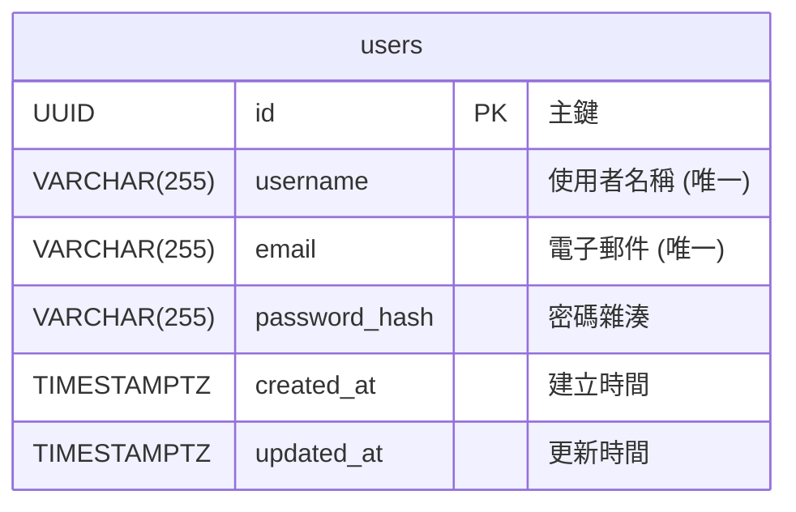

# PostgreSQL 資料庫設計 - Beloved Grandson

## 1. 總覽與設計理念

本文件基於專案的架構文件、架構圖及現有的 MongoDB 設計，提供一份詳盡的 PostgreSQL 資料庫設計方案。

在「Beloved Grandson」專案中，PostgreSQL 的核心職責是儲存**結構化的核心業務資料**，主要聚焦於**使用者資訊**。對話與訊息相關的紀錄由 MongoDB 負責，如 `@document/database/mongoDB.md` 文件所述。

此設計的核心理念是：
-   **資料完整性**: 透過主鍵和唯一約束，確保使用者資料的準確性和一致性。
-   **關注點分離**: PostgreSQL 精準地管理使用者實體，而其他資料儲存系統則處理其各自的領域。
-   **可擴展性**: 清晰的結構有利於未來在使用者模組上擴展新功能。

## 2. 資料表關係 (ERD - Entity Relationship Diagram)



## 3. 資料表定義

### 3.1. `users`

儲存使用者的核心帳號資訊。

| 欄位名稱 | 資料型態 | 主鍵/外鍵 | 索引 | 說明 |
| :--- | :--- | :--- | :--- | :--- |
| `id` | `UUID` | `PRIMARY KEY` | 自動 | 使用者的唯一識別碼，建議使用 UUID 以利於分散式系統。 |
| `username` | `VARCHAR(255)` | | `UNIQUE` | 使用者名稱，必須唯一。 |
| `email` | `VARCHAR(255)` | | `UNIQUE` | 使用者電子郵件，必須唯一，用於登入或通知。 |
| `password_hash`| `VARCHAR(255)` | | | 儲存經雜湊處理後的密碼。 |
| `created_at` | `TIMESTAMPTZ` | | | 帳號建立時間 (包含時區)。 |
| `updated_at` | `TIMESTAMPTZ` | | | 帳號最後更新時間 (包含時區)。 |

## 4. 索引 (Indexes)

為了提升查詢效能並確保資料的唯一性，我們定義了以下索引：

-   **`users` 表**:
    -   `username`:
        ```sql
        CREATE UNIQUE INDEX idx_users_username ON users(username);
        ```
    -   `email`:
        ```sql
        CREATE UNIQUE INDEX idx_users_email ON users(email);
        ```
