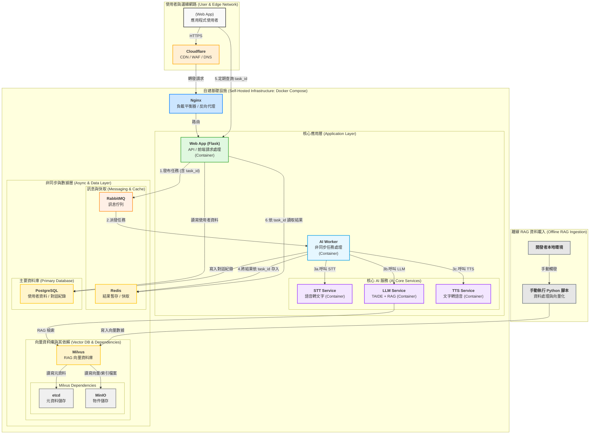

```mermaid

flowchart TD
    %% ----- 1. 定義樣式 (Style Definitions) -----
    classDef user fill:#f9f9f9,stroke:#333,stroke-width:2px
    classDef edge fill:#ffefd5,stroke:#ffa500,stroke-width:2px
    classDef loadbalancer fill:#cce6ff,stroke:#007bff,stroke-width:2px
    classDef app fill:#e0f8e0,stroke:#33a633,stroke-width:2px
    classDef worker fill:#e6f7ff,stroke:#0099e6,stroke-width:2px
    classDef aiservice fill:#f3e6ff,stroke:#9933ff,stroke-width:2px
    classDef messagequeue fill:#fff0e6,stroke:#ff8c1a,stroke-width:2px
    classDef database fill:#fff5cc,stroke:#ffc107,stroke-width:2px
    classDef storage fill:#f0f0f0,stroke:#808080,stroke-width:2px
    classDef dev fill:#e6e6e6,stroke:#6c757d,stroke-width:2px

    %% ----- 2. 定義節點 (Node Definitions) -----

    subgraph "使用者與邊緣網路 (User & Edge Network)"
        User["(Web App)<br>應用程式使用者"]
        Cloudflare["<b>Cloudflare</b><br>CDN / WAF / DNS"]
    end

    subgraph "自建基礎設施 (Self-Hosted Infrastructure: Docker Compose)"
        direction TB
        LB["<b>Nginx</b><br>負載平衡器 / 反向代理"]

        subgraph "核心應用層 (Application Layer)"
            direction TB
            WebApp["<b>Web App (Flask)</b><br>API / 前端請求處理<br>(Container)"]
            AIWorker["<b>AI Worker</b><br>非同步任務處理<br>(Container)"]

            subgraph "核心 AI 服務 (AI Core Services)"
                direction LR
                STT["<b>STT Service</b><br>語音轉文字 (Container)"]
                LLM["<b>LLM Service</b><br>TAIDE + RAG (Container)"]
                TTS["<b>TTS Service</b><br>文字轉語音 (Container)"]
            end
        end

        subgraph "非同步與數據層 (Async & Data Layer)"
            direction TB
            subgraph "訊息與快取 (Messaging & Cache)"
                direction LR
                RabbitMQ["<b>RabbitMQ</b><br>訊息佇列"]
                Redis["<b>Redis</b><br>結果暫存 / 快取"]
            end

            subgraph "主要資料庫 (Primary Database)"
                PostgreSQL["<b>PostgreSQL</b><br>使用者資料 / 對話紀錄"]
            end

            subgraph "向量資料庫與其依賴 (Vector DB & Dependencies)"
                direction TB
                Milvus["<b>Milvus</b><br>RAG 向量資料庫"]
                subgraph "Milvus Dependencies"
                    direction LR
                    Etcd["<b>etcd</b><br>元資料儲存"]
                    MinIO["<b>MinIO</b><br>物件儲存"]
                end
            end
        end
    end

    subgraph "離線 RAG 資料載入 (Offline RAG Ingestion)"
        direction TB
        DevEnv["<b>開發者本地環境</b>"]
        IngestionScript["<b>手動執行 Python 腳本</b><br>資料處理與向量化"]
    end


    %% ----- 3. 建立流程連接 (Flow Connections) -----

    %% 主要請求流程
    User -- "HTTPS" --> Cloudflare
    Cloudflare -- "轉發請求" --> LB
    LB -- "路由" --> WebApp

    %% 非同步任務處理流程
    WebApp -- "1.發布任務 (含 task_id)" --> RabbitMQ
    RabbitMQ -- "2.派發任務" --> AIWorker
    AIWorker -- "3a.呼叫 STT" --> STT
    AIWorker -- "3b.呼叫 LLM" --> LLM
    LLM -- "RAG 檢索" --> Milvus
    AIWorker -- "3c.呼叫 TTS" --> TTS
    AIWorker -- "4.將結果依 task_id 存入" --> Redis

    %% Milvus 內部數據流
    Milvus -- "讀寫元資料" --> Etcd
    Milvus -- "讀寫向量/索引檔案" --> MinIO

    %% 結果查詢流程 (以輪詢為例)
    User -- "5.定期查詢 task_id" --> WebApp
    WebApp -- "6.依 task_id 讀取結果" --> Redis

    %% 一般數據庫存取
    WebApp -- "讀寫使用者資料" --> PostgreSQL
    AIWorker -- "寫入對話紀錄" --> PostgreSQL

    %% 離線資料載入流程
    DevEnv -- "手動觸發" --> IngestionScript
    IngestionScript -- "寫入向量數據" --> Milvus


    %% ----- 4. 應用樣式 (Apply Styles) -----
    class User user
    class Cloudflare edge
    class LB loadbalancer
    class WebApp app
    class AIWorker worker
    class STT,LLM,TTS aiservice
    class RabbitMQ messagequeue
    class Redis,PostgreSQL,Milvus database
    class Etcd,MinIO storage
    class DevEnv,IngestionScript dev
```
