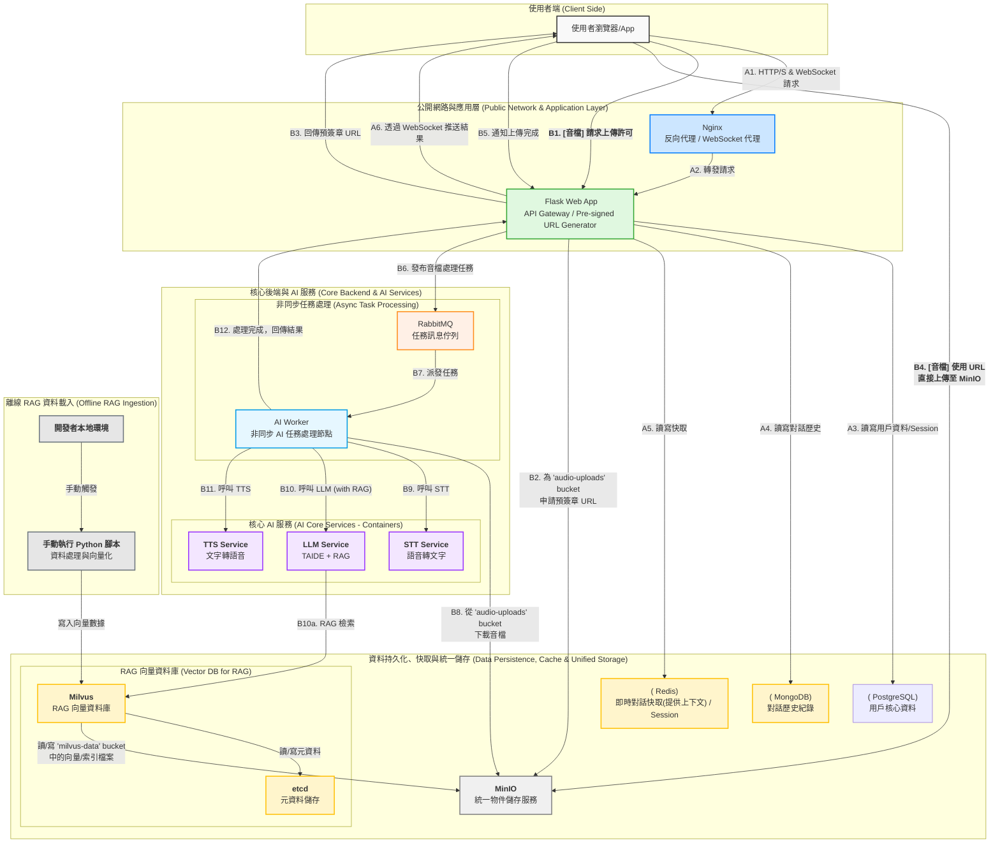

```mermaid
flowchart TD
    %% ----- 1. 定義樣式 (Style Definitions) -----
    classDef user fill:#f9f9f9,stroke:#333,stroke-width:2px
    classDef edge fill:#ffefd5,stroke:#ffa500,stroke-width:2px
    classDef loadbalancer fill:#cce6ff,stroke:#007bff,stroke-width:2px
    classDef app fill:#e0f8e0,stroke:#33a633,stroke-width:2px
    classDef worker fill:#e6f7ff,stroke:#0099e6,stroke-width:2px
    classDef aiservice fill:#f3e6ff,stroke:#9933ff,stroke-width:2px
    classDef messagequeue fill:#fff0e6,stroke:#ff8c1a,stroke-width:2px
    classDef database fill:#fff5cc,stroke:#ffc107,stroke-width:2px
    classDef storage fill:#f0f0f0,stroke:#808080,stroke-width:2px
    classDef dev fill:#e6e6e6,stroke:#6c757d,stroke-width:2px

    %% ----- 2. 定義節點 (Node Definitions) -----

    subgraph "使用者端 (Client Side)"
        Client["<fa:fa-user> 使用者瀏覽器/App"]
    end

    subgraph "公開網路與應用層 (Public Network & Application Layer)"
        direction TB
        Nginx["<fa:fa-server> Nginx<br>反向代理 / WebSocket 代理"]
        WebApp["<fa:fa-flask> Flask Web App<br>API Gateway / Pre-signed URL Generator"]
    end

    subgraph "核心後端與 AI 服務 (Core Backend & AI Services)"
        direction TB
        subgraph "非同步任務處理 (Async Task Processing)"
            direction LR
            RabbitMQ["<fa:fa-envelope> RabbitMQ<br>任務訊息佇列"]
            AIWorker["<fa:fa-cogs> AI Worker<br>非同步 AI 任務處理節點"]
        end
        subgraph "核心 AI 服務 (AI Core Services - Containers)"
            direction LR
            STT["<b>STT Service</b><br>語音轉文字"]
            LLM["<b>LLM Service</b><br>TAIDE + RAG"]
            TTS["<b>TTS Service</b><br>文字轉語音"]
        end
    end

    subgraph "資料持久化、快取與統一儲存 (Data Persistence, Cache & Unified Storage)"
        direction TB
        Postgres["(<fa:fa-database> PostgreSQL)<br>用戶核心資料"]
        MongoDB["(<fa:fa-leaf> MongoDB)<br>對話歷史紀錄"]
        Redis["(<fa:fa-bolt> Redis)<br>即時對話快取(提供上下文) / Session"]

        %% --- 統一後的 MinIO 節點 ---
        MinIO["<b><fa:fa-hdd-o> MinIO</b><br>統一物件儲存服務"]

        subgraph "RAG 向量資料庫 (Vector DB for RAG)"
            Milvus["<b>Milvus</b><br>RAG 向量資料庫"]
            Etcd["<b>etcd</b><br>元資料儲存"]
        end
    end

    subgraph "離線 RAG 資料載入 (Offline RAG Ingestion)"
        direction TB
        DevEnv["<b>開發者本地環境</b>"]
        IngestionScript["<b>手動執行 Python 腳本</b><br>資料處理與向量化"]
    end

    %% ----- 3. 建立流程連接 (Flow Connections) -----

    %% A. 通用請求與基礎互動流程
    Client -- "A1. HTTP/S & WebSocket 請求" --> Nginx
    Nginx -- "A2. 轉發請求" --> WebApp
    WebApp -- "A3. 讀寫用戶資料/Session" --> Postgres
    WebApp -- "A4. 讀寫對話歷史" --> MongoDB
    WebApp -- "A5. 讀寫快取" --> Redis
    WebApp -- "A6. 透過 WebSocket 推送結果" --> Client

    %% B. 音檔上傳與處理流程 (整合後的新流程)
    Client -- "<b>B1. [音檔] 請求上傳許可</b>" --> WebApp
    WebApp -- "B2. 為 'audio-uploads' bucket<br>申請預簽章 URL" --> MinIO
    WebApp -- "B3. 回傳預簽章 URL" --> Client
    Client -- "<b>B4. [音檔] 使用 URL<br>直接上傳至 MinIO</b>" --> MinIO
    Client -- "B5. 通知上傳完成" --> WebApp
    WebApp -- "B6. 發布音檔處理任務" --> RabbitMQ
    RabbitMQ -- "B7. 派發任務" --> AIWorker
    AIWorker -- "B8. 從 'audio-uploads' bucket<br>下載音檔" --> MinIO
    AIWorker -- "B9. 呼叫 STT" --> STT
    AIWorker -- "B10. 呼叫 LLM (with RAG)" --> LLM
    LLM -- "B10a. RAG 檢索" --> Milvus
    AIWorker -- "B11. 呼叫 TTS" --> TTS
    AIWorker -- "B12. 處理完成，回傳結果" --> WebApp

    %% C. RAG 核心依賴流程
    Milvus -- "讀/寫元資料" --> Etcd
    Milvus -- "讀/寫 'milvus-data' bucket<br>中的向量/索引檔案" --> MinIO

    %% D. 離線資料載入流程
    DevEnv -- "手動觸發" --> IngestionScript
    IngestionScript -- "寫入向量數據" --> Milvus

    %% ----- 4. 應用樣式 (Apply Styles) -----
    class Client user
    class Nginx loadbalancer
    class WebApp app
    class AIWorker worker
    class STT,LLM,TTS aiservice
    class RabbitMQ messagequeue
    class Redis,PostgreSQL,MongoDB,Milvus,Etcd database
    class MinIO storage
    class DevEnv,IngestionScript dev
```
