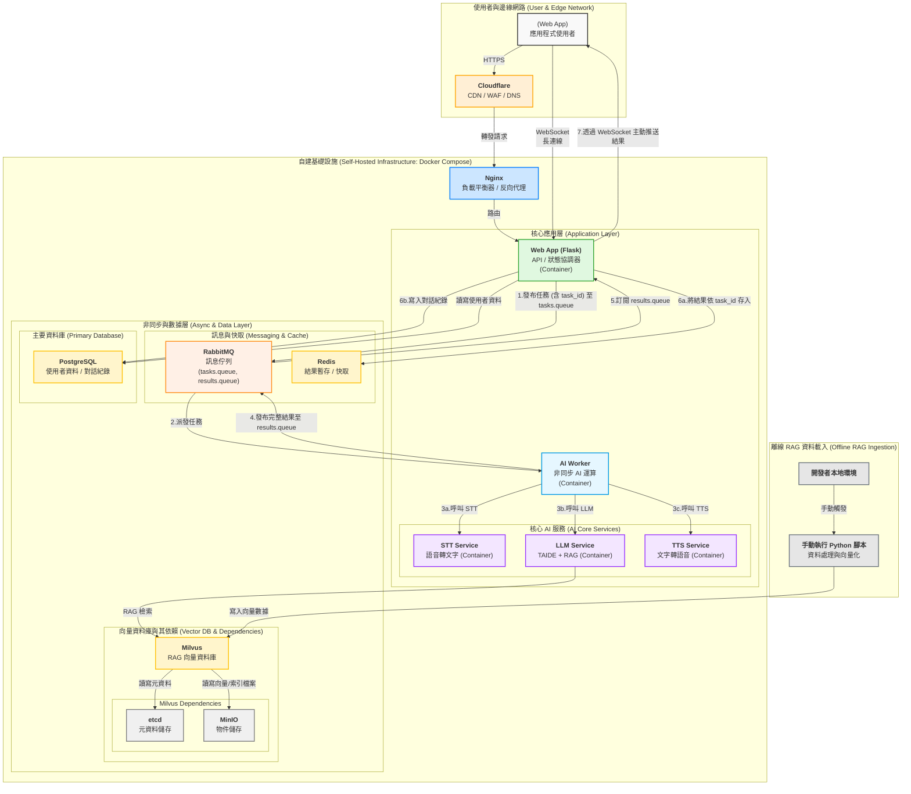

# 系統架構文件

## 1. 總覽

本文件旨在說明系統的整體架構，該架構基於 `docker-compose` 進行容器化部署，實現了一個包含前端、後端、非同步任務處理、AI 服務以及多種數據儲存的微服務體系。

此架構的核心理念是透過容器化技術簡化開發、部署與維運流程，並利用訊息佇列實現服務間的解耦，從而構建一個具備彈性與可擴展性的 AI 應用。

## 2. 架構圖

## 3. 核心組件說明

### 3.1. 邊緣網路 (Edge Network)
*   **Cloudflare**: 作為系統的第一道防線，提供 DNS 解析、CDN 內容快取、WAF (Web Application Firewall) 防火牆等服務，提升全球訪問速度與安全性。

### 3.2. 基礎設施 (Infrastructure)
*   **Nginx**: 擔任負載平衡器與反向代理。所有來自 Cloudflare 的請求都先經過 Nginx，再由其根據路徑或主機名稱路由到後端的 `Web App` 服務。
*   **Docker Compose**: 整個自建基礎設施的核心，用於定義和運行多容器應用。透過 `docker-compose.yml` 文件，可以一鍵啟動、管理和串聯所有服務。

### 3.3. 應用層 (Application Layer)
*   **Web App (Flask)**: 系統的主要入口與**狀態協調器**。其職責包括：
    *   提供 API 端點，處理使用者身份驗證與資料管理。
    *   **(音檔處理)** 接收使用者上傳的音檔，立即將其存入 `MinIO` 物件儲存。
    *   接收 AI 任務請求，將包含 `MinIO` 音檔路徑的任務資訊發布到 `RabbitMQ` 的 `tasks.queue`。
    *   **（即時通知）** 管理 WebSocket 連線，用於向客戶端即時推送任務結果。
    *   提供客戶端查詢任務結果的備用 API (從 Redis 讀取)。
    *   訂閱 `RabbitMQ` 的 `results.queue`，接收 AI Worker 的運算結果。
    *   負責將接收到的結果進行**原子化持久儲存**：更新 `Redis` 中的任務狀態，並將包含 `MinIO` 路徑的完整對話紀錄寫入 `PostgreSQL`。
    *   當結果儲存後，透過對應的 WebSocket 連線將結果主動推送給客戶端。
*   **AI Worker**: 非同步 AI 運算單元。其職責被嚴格限定在執行計算密集型的 AI 任務。它持續監聽 `RabbitMQ` 的 `tasks.queue` 佇列。收到任務後，會依序執行以下操作：
    1.  從任務訊息中取得 `MinIO` 音檔路徑，並從 `MinIO` 下載音檔。
    2.  呼叫 `STT Service` 將語音轉為文字。
    3.  呼叫 `LLM Service` 進行語言模型處理與 RAG 檢索。
    4.  呼叫 `TTS Service` 將模型的文字回覆轉為語音。
    5.  **(音檔處理)** 將 TTS 生成的音檔存回 `MinIO`。
    6.  將包含所有結果（如 `text_response`, `audio_output_url` 指向 `MinIO`）的**單一事件**發布到 `RabbitMQ` 的 `results.queue` 佇列。

### 3.4. AI 核心服務 (AI Core Services)
*   **STT Service (Speech-to-Text)**: 專職的語音轉文字服務。
*   **LLM Service (Large Language Model)**: 核心的大型語言模型服務，整合了 TAIDE 模型與 RAG (Retrieval-Augmented Generation) 技術，能根據 `Milvus` 中的知識庫生成更精確的回答。
*   **TTS Service (Text-to-Speech)**: 專職的文字轉語音服務。

### 3.5. 數據與訊息層 (Data & Messaging Layer)
*   **RabbitMQ**: 高效能的訊息佇列，作為 `Web App` 與 `AI Worker` 之間的中介，實現了請求提交與任務處理的解耦與非同步化。現在包含 `tasks.queue` 和 `results.queue` 兩個主要佇列。
*   **Redis**: In-memory 資料庫，主要用於暫存 `AI Worker` 的任務處理結果，供 `Web App` 快速讀取。
*   **PostgreSQL**: 主要的關聯式資料庫，用於儲存結構化資料，如使用者帳號、設定以及完整的對話歷史紀錄。
*   **MinIO**: S3 相容的物件儲存服務。在此架構中扮演雙重角色：
    *   **主要音檔儲存**: 統一儲存所有使用者上傳的輸入音檔 (`audio-inputs` bucket) 和 AI 生成的輸出音檔 (`audio-outputs` bucket)。
    *   **Milvus 依賴**: 為 Milvus 提供底層的物件儲存，用於存放向量索引等檔案。
*   **Milvus**: 專為 AI 應用設計的向量資料庫，用於儲存 RAG 所需的向量化知識數據。
    *   **etcd**: 為 Milvus 提供元資料 (Metadata) 的儲存與管理服務。

### 3.6. 離線資料處理 (Offline Data Processing)
*   **RAG Ingestion Script**: 一個在開發者本地環境手動執行的 Python 腳本，用於處理、向量化知識文件，並將結果寫入 `Milvus`，以供 `LLM Service` 進行 RAG 檢索。

## 4. 核心工作流程

### 4.1. 音檔儲存與非同步 AI 任務處理流程 (WebSocket 推送)
1.  **上傳與存入 MinIO**: 使用者透過客戶端上傳音檔。請求到達 `Web App`。`Web App` 立即將音檔串流至 `MinIO` 的 `audio-inputs` 儲存桶 (bucket) 中，並取得該物件的內部存取路徑。
2.  **提交任務並建立 WebSocket**: `Web App` 回應一個 `task_id`。客戶端收到 `task_id` 後，立即建立一個指向 `Web App` 的 WebSocket 連線，用於接收該任務的結果。
3.  **發布任務至佇列**: `Web App` 將包含 `MinIO` 物件路徑與 `task_id` 的任務訊息發布到 `RabbitMQ` 的 `tasks.queue`。
4.  **派發與處理**: `RabbitMQ` 將任務推送給 `AI Worker`。`AI Worker` 從訊息中解析出 `MinIO` 路徑，從 `MinIO` 下載音檔進行 STT, LLM, TTS 等 AI 運算。
5.  **存回 MinIO**: `AI Worker` 將 TTS 生成的音檔存回 `MinIO` 的 `audio-outputs` 儲存桶。
6.  **發布結果**: `AI Worker` 完成運算後，將包含 `MinIO` 輸出音檔路徑的完整結果發布到 `RabbitMQ` 的 `results.queue`。
7.  **訂閱、儲存與推送**: `Web App` 訂閱 `results.queue`。收到結果後，它會執行**原子性的資料庫操作**：將包含 `MinIO` 路徑的完整對話紀錄寫入 `PostgreSQL`，並更新 `Redis` 中的任務狀態與結果。最後，`Web App` 透過先前建立的 WebSocket 連線，將儲存在 `Redis` 中的最終結果**主動推送**給指定的客戶端。
8.  **備用查詢機制**: 如果 WebSocket 連線因故中斷，客戶端仍可使用 `task_id` 透過傳統的 HTTP GET 請求 (`/api/tasks/{task_id}`) 來獲取結果。

## 5. LLM 配置建議

為了確保模型回覆的品質與效率，建議 `LLM Service` 採用以下預設配置：

*   `Temperature: 0.2`: 確保回覆的穩定性與一致性，適合以 RAG 為基礎的知識型問答。
*   `Token Limit: 1024`: 為回覆長度設定合理的上限，避免資源過度消耗。
*   `Top-K: 40`, `Top-P: 0.8`: 限制模型生成時的候選詞彙，避免產生不相關或奇怪的回答，同時保留一定的多樣性。
