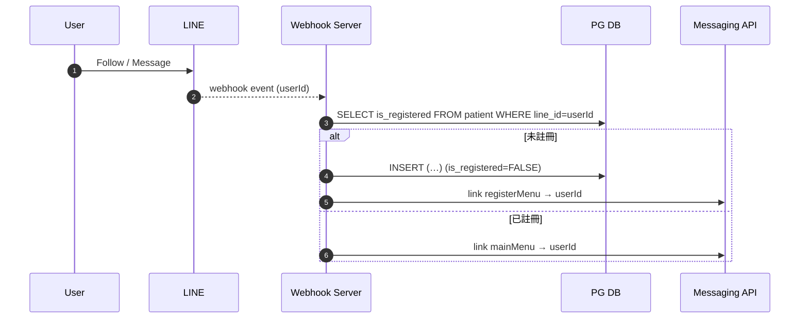

# 前端設計規範書（高齡 COPD 病患 LIFF 應用）

_版本 v1.0 – 2025-08-02_

---

## 1. 專案概覽

| 欄位         | 說明                                                                                                             |
| ------------ | ---------------------------------------------------------------------------------------------------------------- |
| **專案名稱** | **RespiraAlly LIFF (MPA)**                                                                                       |
| **對象**     | 65+ 歲慢性阻塞性肺病（COPD）                                                                                     |
| **核心目標** | 以「一頁一任務」式互動，協助患者：<br>• 回報每日健康行為<br>• 完成 CAT／mMRC 評估<br>• 透過語音與 AI 溝通        |
| **特色摘要** | 適老化 UI（大字、高對比、大按鈕） · 直覺工作流程 · 後端 REST / WebSocket 無縫整合 · Rich-Menu 依註冊狀態動態指派 |

---

## 2. 頁面架構

```plaintext
liff-app/
├─ asset/
├─ common/            核心工具 (api.js · auth.js · base.css)
├─ register/          首次註冊
|  └─register.py
└─ menu/              主選單 (圖文卡片導航)
   └─menu.py
      ├─ voice/             語音互動
      |  └─voice.html
      ├─ tracking/          每日健康追蹤
      |  └─daily_health.html
      ├─ cat-mmrc/          CAT + mMRC 量表
      |  ├─cat.html
      |  ├─mmrc.html
      |  └─thankyou.html
      └─ report/            健康趨勢報表
         └─userstatus.html
```

- **路由模式**：Multi-Page；每頁獨立 `index.html`，由 Rich Menu deep-link 直接開啟。
- **Rich Menu**：

  - `registerMenu`── 僅首次指派，含「填寫會員資料」按鈕
  - `mainMenu`── 語音 / Tracking / CAT+mMRC / 報表

---

## 3. 數據流與互動依賴關係

### 3-1 資訊傳遞架構（Webhook 序列圖）



> **完成註冊** 時，`/auth/line/register` → `UPDATE is_registered=TRUE` → `link mainMenu`.

### 3-2 狀態管理模式

| 範圍 | 工具               | 存放項目                                              | 生命週期     |
| ---- | ------------------ | ----------------------------------------------------- | ------------ |
| 永續 | `localStorage`     | `access_token`, `userProfile`, 最近一次 tracking 草稿 | 跨頁／跨啟動 |
| 單頁 | JS 模組區域變數    | 表單值、錄音暫存                                      | 頁面存活期間 |
| 背景 | WebSocket 連線物件 | 30 s 心跳；失敗 3 次改輪詢                            | 語音頁限定   |

---

## 4. 視覺設計系統

| 類別       | 規格                                                                                         |
| :--------- | :------------------------------------------------------------------------------------------- |
| **字體**   | Noto Sans TC；正文 18 px；標題 24 px                                                         |
| **色彩**   | `--primary:#0078D4` `--secondary:#00B294` `--danger:#D83B01` `--bg:#FBFBFB` `--text:#1F1F1F` |
| **按鈕**   | 高 56 px；圓角 12 px；Primary 按鈕使用 `--primary`                                           |
| **圖示**   | Heroicons SVG (Outline)                                                                      |
| **圖表**   | Chart.js 4；軸線寬 2 px；字體沿用頁面                                                        |
| **可及性** | 對比 ≥ 4.5；焦點狀態加粗外框；所有互動元件 ≥ 48 × 48 px                                      |

---

## 5. 開發原則模式

1. **單一任務頁面**：index.html + \*.js + \*.css；互不跳轉。(唯獨 CAT.html -> mMRC.html -> thankyou.html)
2. **BEM 命名**：`.tracking__input--invalid` 等；全局變數以 CSS Custom Properties。
3. **核心工具共用**：`common/api.js`（Fetch + Retry + Token）、`auth.js`（LIFF OAuth 驗簽）。
4. **嚴格錯誤邊界**：每頁主要流程包 `tryWrapper(fn, fallbackUI)`。
5. **不可變資料**：API 回傳結果凍結 (`Object.freeze`)；變更用淺拷貝。

---

## 6. 錯誤處理與容錯策略

| 層級          | 策略                            | 行為                                 |
| ------------- | ------------------------------- | ------------------------------------ |
| **API**       | `fetchWithRetry` (2 × 回退)     | 連線失敗 → 顯示 `.error-card` 與重試 |
| **Auth**      | 401 → 自動 `/auth/refresh`      | 仍失敗 → 導向 `register` 頁          |
| **表單**      | `validate(schema, data)`        | aria-invalid + 語音＆紅框提示        |
| **WebSocket** | 30 s ping；失敗 ≥ 3 → HTTP 輪詢 | 顯示「離線模式」提示                 |
| **元件**      | `tryWrapper`                    | 例外 → 渲染 fallback UI              |

---

## 7. 技術棧與依賴

| 分類          | 套件 / 規格                     | 官方文件                                                                                                               |
| ------------- | ------------------------------- | ---------------------------------------------------------------------------------------------------------------------- |
| 前端基礎      | **HTML 5 / CSS 3 / ES Modules** | [https://developer.mozilla.org/](https://developer.mozilla.org/)                                                       |
| 語音          | Web Speech API                  | [https://developer.mozilla.org/docs/Web/API/Web_Speech_API](https://developer.mozilla.org/docs/Web/API/Web_Speech_API) |
| 圖表          | Chart.js 4                      | [https://www.chartjs.org/docs/latest/](https://www.chartjs.org/docs/latest/)                                           |
| LIFF          | `@line/liff` v2                 | [https://developers.line.biz/en/docs/liff/](https://developers.line.biz/en/docs/liff/)                                 |
| Messaging API | LINE Bot API                    | [https://developers.line.biz/en/reference/messaging-api/](https://developers.line.biz/en/reference/messaging-api/)     |
| 測試          | Vitest / Cypress                | [https://vitest.dev/](https://vitest.dev/) ・ [https://www.cypress.io/](https://www.cypress.io/)                       |

---

## 8. API 整合規範

- **基礎 URL** `https://api.respiraally.tw/api/v1/`
- **標頭**

  ```http
  Authorization: Bearer <JWT>
  X-Request-ID: <uuid4>
  Content-Type: application/json
  ```

- **統一回應**

  ```jsonc
  // success
  { "status":"success", "data":{…}, "request_id":"4f1c3b…" }

  // error
  { "status":"error", "code":4003, "message":"Validation failed", "request_id":"4f1c3b…" }
  ```

- **Rich Menu**

  - `/register`：註冊完成 → `link mainMenu`
  - 重新加好友 → Webhook 檢查 `is_registered` → 決定菜單

- **WebSocket** `wss://api.respiraally.tw/ws/chat/<conversation_id>?token=<JWT>`

  - ping 30 s；pong 10 s 內未回 → close & fallback

---

## 9. 數據格式規範（節錄）

- 參考 data_FE.md

### ➡️ 後續需求

- Rich Menu JSON & 圖檔佈署腳本
- 各頁完整 HTML / JS 範例
- Docker-Compose or Zeabur 自動部署配置

如需擴充，隨時提出！
