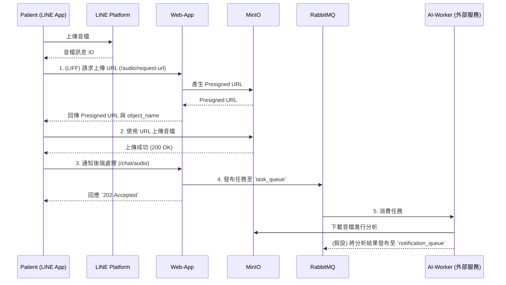

# 技術解說文件 - web-app 服務

本文檔旨在詳細闡述 `web-app` 服務的技術架構、設計模式與數據流。此服務是「Beloved Grandson」專案的核心後端，同時為病患使用的 **Line Bot** 和治療師使用的 **Web Dashboard** 提供支援。

## 1. 通用設計模式與架構

`web-app` 採用了多種現代化的設計模式來確保程式碼的模組化、可維護性和可測試性。

### 1.1 Flask 模板製作的設計模式 (Application Factory)

專案採用 **應用程式工廠（Application Factory）** 模式來建立 Flask 實例。

- **實作檔案**: `beloved_grandson/services/web-app/app/app.py`
- **核心函數**: `create_app(config_name='default')`

**運作方式**:

1.  **動態建立**: Flask `app` 物件不是在全域範圍內宣告，而是在 `create_app` 函數中建立。
2.  **配置載入**: 根據傳入的 `config_name`（如 `development`, `production`, `testing`），從 `app/config.py` 載入對應的設定。
3.  **擴充套件初始化**: 所有 Flask 擴充套件（如 `db` for SQLAlchemy, `migrate`, `swagger`, `jwt`, `socketio`）都在工廠函數內進行初始化，避免了循環依賴問題。
4.  **藍圖註冊**: 將定義好的 API 藍圖（Blueprints）註冊到 `app` 實例上。

這種模式的主要優點是能夠針對不同環境（開發、測試、生產）使用不同的設定來建立多個應用程式實例，特別有助於自動化測試。

### 1.2 藍圖 (Blueprints)

專案的 API 端點是透過 **藍圖（Blueprints）** 來組織的。

- **實作目錄**: `beloved_grandson/services/web-app/app/api/`

每個 `*.py` 檔案（例如 `auth.py`, `patients.py`）都定義了一個 Blueprint，將相關的路由組織在一起。例如，所有與身份驗證相關的 API 都在 `auth_bp` 中。這些藍圖最終在 `create_app` 函數中被註冊，使路由管理更加清晰。

### 1.3 倉儲模式 (Repository Pattern) & 服務層 (Service Layer)

專案在核心邏輯層 (`app/core/`) 採用了倉儲模式和服務層來分離職責。

- **倉儲層 (Repository)**:

  - **目錄**: `beloved_grandson/services/web-app/app/core/*_repository.py`
  - **職責**: 負責抽象化數據持久化邏輯。例如，`UserRepository` 封裝了所有對 `User` 模型（PostgreSQL）的資料庫操作；`ChatRepository` 則封裝了對 MongoDB 的操作。這使得業務邏輯不需要知道底層數據庫的細節。

- **服務層 (Service)**:
  - **目錄**: `beloved_grandson/services/web-app/app/core/*_service.py`
  - **職責**: 包含核心業務邏輯。服務層會呼叫倉儲層來讀寫數據，並執行業務規則。例如，`DailyMetricService` 的 `create_daily_metric` 方法會先驗證輸入數據，然後檢查當天是否已存在記錄，最後才呼叫 `DailyMetricRepository` 來建立新記錄。

---

## 2. Line Bot 系統

此系統主要服務於病患，透過 LINE LIFF 應用程式和後端 API 進行互動。

### 2.1 前端設計 (LIFF) / Core 互動

- **前端**: 一個運行在 LINE App 內的網頁應用（LIFF），其靜態檔案位於 `app/static/liff.html`。
- **互動核心**: `app/core/` 中的 `line_service.py`, `auth_service.py`, `questionnaire_service.py`, `daily_metric_service.py`。

**數據交換**:

- **前端輸入 (Input)**:

  - **註冊/登入**: 使用者 `lineUserId`。
  - **註冊資料**: 姓名、性別、電話等基本資料 (`auth_service.register_line_user`)。
  - **健康日誌**: 喝水量、服藥狀況、運動時間、抽菸數量 (`daily_metric_service.create_daily_metric`)。
  - **問卷**: CAT 和 MMRC 問卷的各項分數 (`questionnaire_service.submit_cat_questionnaire`)。
  - **音檔**: 透過預簽章 URL 上傳至 MinIO，並將檔名通知後端。

- **後端輸出 (Output)**:
  - **Token**: 登入成功後回傳 JWT，用於後續 API 的身份驗證。
  - **使用者資料**: 使用者個人檔案與健康資訊。
  - **操作結果**: 成功或失敗的 JSON 回應。

### 2.2 API 串接架構 (`@api/`)

Line Bot 系統主要依賴以下 API 端點：

- `POST /api/v1/auth/line/login`: 使用 `lineUserId` 進行登入。
- `POST /api/v1/auth/line/register`: 註冊新使用者並建立健康檔案。
- `POST /chat/webhook`: **核心入口**，接收來自 LINE 平台的所有事件（如訊息、追蹤/取消追蹤）。
- `POST /patients/<int:patient_id>/daily_metrics`: 新增每日健康日誌。
- `POST /patients/<int:patient_id>/questionnaires/cat`: 提交 CAT 問卷。
- `POST /patients/<int:patient_id>/questionnaires/mmrc`: 提交 MMRC 問卷。
- `POST /audio/request-url`: 向 MinIO 請求一個有時效性的預簽章 URL，供前端直接上傳音檔。
- `POST /chat/audio`: 當音檔上傳至 MinIO 後，前端呼叫此 API 通知後端處理該檔案。

### 2.3 前後端依賴、數據流向、容錯開發

**外部依賴**:

- **LINE Platform**: 接收與發送訊息。
- **PostgreSQL**: 儲存使用者、健康檔案、問卷等結構化數據。
- **MongoDB**: 儲存對話歷史記錄。
- **MinIO**: 儲存使用者上傳的音檔。
- **RabbitMQ**: 作為消息隊列，用於解耦和非同步處理耗時任務。

**數據流向 (以音檔訊息為例)**:



**容錯開發**:

- **非同步處理**: 透過 RabbitMQ，`web-app` 在接收到需要長時間處理的請求（如音檔分析）時，會立即將任務放入隊列並回傳 `202 Accepted`。這可以防止 LINE Webhook 超時，並確保即使後續處理失敗，請求也不會丟失，提高了系統的彈性和可靠性。
- **Webhook 穩定性**: `line_webhook` 的邏輯被設計得非常輕量，僅做簽名驗證和任務分發，確保能快速回應 LINE 平台，避免重試。

---

## 3. Web Dashboard 系統 (治療師後台)

此系統是一個傳統的 Web 應用程式，供呼吸治療師管理病患、查看健康數據和對話記錄。

### 3.1 前端設計 (Dashboard) / Core 互動

- **前端**: 一個（假設的）單頁應用程式（SPA），可能是 React 或 Vue，與後端 API 進行互動。
- **互動核心**: `app/core/` 中的 `auth_service.py`, `patient_service.py`, `user_service.py` 等。

**數據交換**:

- **前端輸入 (Input)**:

  - **登入**: 治療師的帳號 (`account`) 和密碼。
  - **查詢參數**: 獲取病患列表時的分頁 (`page`, `per_page`) 和排序 (`sort_by`, `order`) 參數。
  - **病患 ID**: 用於獲取特定病患的詳細資料。

- **後端輸出 (Output)**:
  - **Token**: 登入成功後回傳 JWT。
  - **病患列表**: 分頁後的病患簡要資訊列表。
  - **病患詳情**: 單一病患的完整個人檔案、健康數據歷史和對話記錄。

### 3.2 API 串接架構 (`@api/`)

Web Dashboard 主要依賴以下 API 端點，所有端點都受 `@jwt_required()` 保護：

- `POST /api/v1/auth/login`: 治療師登入。
- `GET /api/v1/therapist/patients`: 獲取當前治療師所管理的所有病患列表。
- `GET /api/v1/patients/<int:patient_id>/profile`: 獲取單一病患的詳細檔案。
- `GET /api/v1/patients/<int:patient_id>/daily_metrics`: 獲取病患的每日健康日誌歷史。
- `GET /api/v1/patients/<int:patient_id>/questionnaires/cat`: 獲取病患的 CAT 問卷歷史。
- `GET /api/v1/patients/<int:patient_id>/questionnaires/mmrc`: 獲取病患的 MMRC 問卷歷史。
- `GET /patients/<int:patient_id>/conversations`: 獲取病患的所有對話列表 (from MongoDB)。
- `GET /conversations/<string:conversation_id>/messages`: 獲取單一對話的所有訊息。

### 3.3 前後端依賴、數據流向、容錯開發

**外部依賴**:

- **PostgreSQL**: 主要數據來源。
- **MongoDB**: 對話記錄來源。
- **Socket.IO**: 用於接收即時通知。

**數據流向與即時更新**:

```mermaid
graph TD
    subgraph Browser
        A[Dashboard UI]
    end

    subgraph "Web-App Service"
        B[API Endpoints]
        C[Database (Postgres/Mongo)]
        D[Socket.IO Server]
        E[Notification Listener]
    end

    subgraph "Message Queue"
        F[RabbitMQ]
    end

    A -- "1. API Request (e.g., GET /patients)" --> B
    B -- "2. Query Data" --> C
    C -- "3. Return Data" --> B
    B -- "4. JSON Response" --> A

    F -- "5. New message from Patient (via AI-Worker)" --> E
    E -- "6. Emit 'notification' event" --> D
    D -- "7. WebSocket Push" --> A
    A -- "8. Update UI in real-time" --> A

```

**數據流說明**:

1.  **標準數據請求**: Dashboard 透過標準的 RESTful API 請求數據（流程 1-4）。
2.  **即時通知**: `web-app` 內部有一個 `notification_service`，它會啟動一個背景執行緒 (`start_notification_listener`) 來監聽來自 RabbitMQ 的 `notification_queue`。當 AI Worker 處理完一個任務（例如分析完一則新訊息）後，會向此隊列發布通知。`notification_service` 收到通知後，會透過 `socketio.emit()` 將事件廣播給所有連接的 Dashboard 客戶端（流程 5-8）。這使得 Dashboard 能夠即時顯示更新，而無需輪詢。

**容錯開發**:

- **權限控制**: API 端點透過 `@jwt_required()` 確保使用者已登入。此外，在服務層或 API 層有明確的權限檢查邏輯（如 `daily_metrics.py` 中的 `check_permission`），確保治療師只能存取其管理的病患數據。
- **統一錯誤處理**: `app/app.py` 中定義了全域的 `errorhandler` (404, 500)，為客戶端提供了一致的錯誤回應格式。

---

## 4. 外部服務依賴總結

- **PostgreSQL**: 核心關聯式資料庫，儲存使用者、健康檔案、員工資料、問卷、每日指標等結構化數據。
- **MongoDB**: NoSQL 資料庫，專門用於儲存非結構化的對話 (`conversations`) 和訊息 (`chat_messages`) 歷史。
- **RabbitMQ**: 消息代理，作為系統的非同步中樞。`task_queue` 用於分發耗時任務給 AI Worker，`notification_queue`（假設）用於接收處理結果以觸發即時通知。
- **MinIO**: 物件儲存服務，用於存放使用者上傳的音檔等二進位檔案。
- **Redis**: 在 `.flaskenv.example` 中有定義，但從程式碼中看主要用於 Socket.IO 的消息代理（在生產環境中常見配置），或可作為快取使用。
