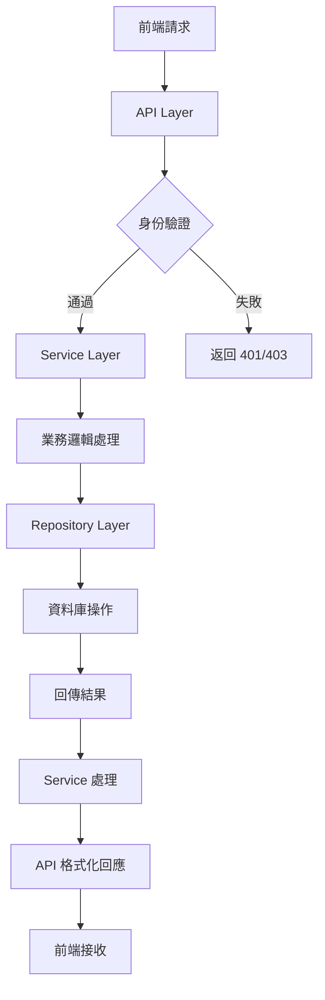
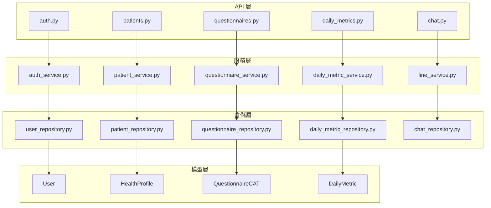

# Web-App 前端技術解說文件

## 專案概述

本專案是「要復肺 - AI 智慧語音機器人」的後端 Flask 應用，採用分層架構設計，提供 REST API 服務並支援 LINE Bot 整合。專案主要服務於呼吸治療系統，包含病患管理、健康日誌、問卷調查等功能。

## 1. 專案架構說明

### 1.1 整體架構概覽

```
services/web-app/
├── app/
│   ├── api/          # API 層（Controller）
│   ├── core/         # 核心業務層（Service + Repository）
│   ├── models/       # 數據模型層
│   ├── static/       # 靜態資源（HTML/CSS/JS）
│   ├── app.py        # 應用程式工廠
│   ├── config.py     # 配置管理
│   └── extensions.py # 擴展初始化
├── migrations/       # 資料庫遷移
└── tests/           # 測試套件
```

### 1.2 三層架構詳解

#### API 層（Controller Layer）

**位置：** `app/api/`
**職責：** 處理 HTTP 請求、參數驗證、回應格式化

```python
# 典型的 API 層結構
app/api/
├── __init__.py
├── auth.py          # 認證相關 API
├── patients.py      # 病患管理 API
├── questionnaires.py # 問卷系統 API
├── daily_metrics.py # 日常健康指標 API
├── uploads.py       # 檔案上傳 API
├── users.py         # 使用者管理 API
└── chat.py          # 聊天系統 API
```

**API 層特點：**

- 使用 Flask Blueprint 組織路由
- 整合 Swagger 文件（Flasgger）
- JWT 權限驗證
- 統一的錯誤處理格式

#### 核心業務層（Core Layer）

**位置：** `app/core/`
**職責：** 業務邏輯處理、數據驗證、第三方服務整合

##### 服務層（Service Layer）

```python
app/core/
├── auth_service.py       # 認證服務
├── user_service.py       # 使用者服務
├── patient_service.py    # 病患服務
├── questionnaire_service.py # 問卷服務
├── daily_metric_service.py  # 日常指標服務
├── line_service.py       # LINE Bot 服務
├── minio_service.py      # 檔案儲存服務
├── rabbitmq_service.py   # 訊息佇列服務
└── notification_service.py # 通知服務
```

##### 倉儲層（Repository Layer）

```python
app/core/
├── user_repository.py          # 使用者數據存取
├── patient_repository.py       # 病患數據存取
├── questionnaire_repository.py # 問卷數據存取
├── daily_metric_repository.py  # 日常指標數據存取
└── chat_repository.py          # 聊天記錄數據存取
```

#### 數據模型層（Model Layer）

**位置：** `app/models/`
**職責：** 定義資料庫結構、ORM 映射

```python
# 主要模型
├── User              # 使用者（病患/治療師/管理員）
├── HealthProfile     # 健康檔案
├── StaffDetail       # 員工詳細資訊
├── DailyMetric       # 日常健康指標
├── QuestionnaireCAT  # CAT 問卷
└── QuestionnaireMMRC # MMRC 問卷
```

## 2. 資訊流與依賴關係

### 2.1 請求處理流程



### 2.2 依賴關係圖



### 2.3 資料流向說明

#### 典型 CRUD 操作流程

```python
# 範例：建立日常健康指標
前端 POST 請求
→ daily_metrics.py (API 層)
→ DailyMetricService.create_daily_metric() (服務層)
→ DailyMetricRepository.create_daily_metric() (倉儲層)
→ DailyMetric 模型 (資料庫)
→ 回傳結果路徑相反
```

## 3. 設計模式

### 3.1 應用程式工廠模式（Application Factory Pattern）

```python
# app/app.py
def create_app(config_name='default'):
    app = Flask(__name__)
    app.config.from_object(config[config_name])

    # 初始化擴展
    db.init_app(app)
    migrate.init_app(app, db)
    jwt.init_app(app)

    # 註冊 Blueprint
    app.register_blueprint(auth_bp)
    app.register_blueprint(patients_bp)

    return app, socketio
```

**優點：**

- 支援多環境配置
- 便於測試
- 延遲初始化擴展

### 3.2 倉儲模式（Repository Pattern）

```python
# 範例：user_repository.py
class UserRepository:
    def find_by_account(self, account):
        return User.query.filter_by(account=account).first()

    def find_by_id(self, user_id):
        return User.query.get(user_id)

    def add(self, user):
        db.session.add(user)

    def commit(self):
        db.session.commit()
```

**優點：**

- 分離業務邏輯與數據存取
- 便於測試和維護
- 數據存取邏輯集中化

### 3.3 服務層模式（Service Layer Pattern）

```python
# 範例：daily_metric_service.py
class DailyMetricService:
    def __init__(self):
        self.repository = DailyMetricRepository()
        self.user_repository = UserRepository()

    def create_daily_metric(self, patient_id, data):
        # 1. 驗證病患存在
        patient = self.user_repository.find_by_id(patient_id)
        if not patient:
            return None, "Patient not found"

        # 2. 業務邏輯驗證
        error = _validate_metric_data(data)
        if error:
            return None, error

        # 3. 建立記錄
        return self.repository.create_daily_metric(patient_id, data)
```

**優點：**

- 封裝複雜業務邏輯
- 協調多個倉儲操作
- 提供統一的業務介面

### 3.4 藍圖模式（Blueprint Pattern）

```python
# 範例：auth.py
auth_bp = Blueprint('auth', __name__, url_prefix='/api/v1/auth')

@auth_bp.route('/login', methods=['POST'])
@swag_from({...})  # Swagger 文件
def handle_login():
    # 處理登入邏輯
    pass
```

**優點：**

- 模組化路由管理
- 便於組織大型應用
- 支援前綴和子應用

## 4. 前端結合 Flask Templates 製作

### 4.1 目前靜態檔案結構

```
app/static/
├── liff.html      # LINE Front-end Framework 頁面
└── cat_form.html  # CAT 問卷表單（422 行）
```

### 4.2 模板整合策略

#### 方案一：純 API + SPA 前端（推薦）

```javascript
// 前端使用 Vue.js/React + Axios
const api = axios.create({
  baseURL: "/api/v1",
  headers: {
    Authorization: `Bearer ${token}`,
  },
});

// 範例：獲取病患資料
async function getPatients() {
  try {
    const response = await api.get("/therapist/patients");
    return response.data;
  } catch (error) {
    console.error("API Error:", error);
  }
}
```

#### 方案二：混合模式（Flask Templates + API）

```python
# 新增模板路由
@app.route('/dashboard')
@jwt_required()
def dashboard():
    return render_template('dashboard.html')

@app.route('/patients')
@jwt_required()
def patients_page():
    return render_template('patients.html')
```

```html
<!-- templates/dashboard.html -->
<!DOCTYPE html>
<html>
  <head>
    <title>Dashboard</title>
    <script src="https://cdn.jsdelivr.net/npm/axios/dist/axios.min.js"></script>
  </head>
  <body>
    <div id="app">
      <!-- 頁面內容 -->
    </div>

    <script>
      // 使用 API 獲取數據
      async function loadDashboard() {
        const token = localStorage.getItem("jwt_token");
        const response = await axios.get("/api/v1/therapist/patients", {
          headers: { Authorization: `Bearer ${token}` },
        });
        // 渲染數據
      }
    </script>
  </body>
</html>
```

### 4.3 LIFF 應用整合

專案已整合 LINE Front-end Framework：

```python
# auth.py - 提供 LIFF 頁面
@auth_bp.route('/liff', methods=['GET'])
def serve_liff_page():
    return send_from_directory(current_app.static_folder, 'liff.html')
```

### 4.4 前端開發建議

#### 技術棧推薦

```json
{
  "framework": "Vue.js 3 / React 18",
  "state_management": "Pinia / Redux Toolkit",
  "http_client": "Axios",
  "ui_library": "Element Plus / Ant Design",
  "build_tool": "Vite",
  "css_framework": "Tailwind CSS"
}
```

#### API 整合範例

```javascript
// api/auth.js
export const authAPI = {
  login: (credentials) => axios.post("/api/v1/auth/login", credentials),

  loginLine: (lineUserId) =>
    axios.post("/api/v1/auth/line/login", { lineUserId }),

  register: (userData) => axios.post("/api/v1/auth/line/register", userData),
};

// api/patients.js
export const patientsAPI = {
  getTherapistPatients: (params) =>
    axios.get("/api/v1/therapist/patients", { params }),

  getPatientProfile: (patientId) =>
    axios.get(`/api/v1/patients/${patientId}/profile`),
};
```

#### 狀態管理範例（Pinia）

```javascript
// stores/auth.js
export const useAuthStore = defineStore("auth", () => {
  const token = ref(localStorage.getItem("jwt_token"));
  const user = ref(null);

  const login = async (credentials) => {
    const response = await authAPI.login(credentials);
    token.value = response.data.token;
    user.value = response.data.user;
    localStorage.setItem("jwt_token", token.value);
  };

  return { token, user, login };
});
```

## 5. API 端點總覽

### 5.1 認證相關

```
POST /api/v1/auth/login              # 治療師登入
POST /api/v1/auth/line/login         # LINE 使用者登入
POST /api/v1/auth/line/register      # LINE 使用者註冊
GET  /api/v1/auth/liff              # LIFF 頁面
```

### 5.2 病患管理

```
GET /api/v1/therapist/patients                    # 治療師的病患列表
GET /api/v1/patients/{patient_id}/profile         # 病患詳細檔案
```

### 5.3 健康資料

```
GET  /api/v1/patients/{patient_id}/daily_metrics  # 獲取日常指標
POST /api/v1/patients/{patient_id}/daily_metrics  # 新增日常指標
PUT  /api/v1/patients/{patient_id}/daily_metrics/{date} # 更新指標
```

### 5.4 問卷系統

```
# CAT 問卷
GET  /api/v1/patients/{patient_id}/questionnaires/cat
POST /api/v1/patients/{patient_id}/questionnaires/cat
PUT  /api/v1/patients/{patient_id}/questionnaires/cat/{year}/{month}

# MMRC 問卷
GET  /api/v1/patients/{patient_id}/questionnaires/mmrc
POST /api/v1/patients/{patient_id}/questionnaires/mmrc
PUT  /api/v1/patients/{patient_id}/questionnaires/mmrc/{year}/{month}
```

### 5.5 聊天系統

```
POST /api/v1/chat/text                           # 文字訊息
POST /api/v1/chat/audio                          # 語音訊息
GET  /api/v1/patients/{patient_id}/conversations # 對話記錄
GET  /api/v1/conversations/{conversation_id}/messages # 訊息記錄
POST /api/v1/chat/webhook                        # LINE Webhook
```

### 5.6 檔案上傳

```
POST /audio/request-url  # 請求音檔上傳 URL
```

## 6. 開發環境設定

### 6.1 後端啟動

```bash
cd services/web-app
python -m venv venv
source venv/bin/activate  # macOS/Linux
pip install -r requirements.txt

# 設定環境變數
cp .flaskenv.example .flaskenv

# 資料庫初始化
flask db upgrade
python seed_data.py

# 啟動服務
flask run
```

### 6.2 前端開發環境

```bash
# 如果使用 Vue.js
npm create vue@latest frontend
cd frontend
npm install axios

# 設定代理（開發環境）
# vite.config.js
export default {
  server: {
    proxy: {
      '/api': 'http://localhost:5000'
    }
  }
}
```

## 7. 部署與生產環境

### 7.1 Docker 部署

專案已配置 Docker 環境：

```bash
# 開發環境
docker-compose -f docker-compose.dev.yml up

# 生產環境
docker-compose -f docker-compose.prod.yml up
```

### 7.2 前端建置部署

```bash
# 建置前端
npm run build

# 整合到 Flask static 目錄
cp -r dist/* services/web-app/app/static/
```

## 8. 注意事項與最佳實踐

### 8.1 安全性

- 所有 API 使用 JWT 認證
- 敏感操作需要權限檢查
- 檔案上傳使用預簽名 URL

### 8.2 錯誤處理

- 統一的錯誤回應格式
- 詳細的錯誤代碼系統
- 適當的 HTTP 狀態碼

### 8.3 效能考量

- 使用分頁查詢
- 資料庫查詢最佳化
- 靜態檔案快取

### 8.4 測試

- 完整的單元測試覆蓋
- API 整合測試
- 前端 E2E 測試建議

---

這份文件提供了完整的技術架構說明，前端開發者可以根據此文件快速理解系統架構並開始開發工作。如有任何問題，請參考專案中的 Swagger 文件（`/apidocs/`）或聯繫後端開發團隊。
