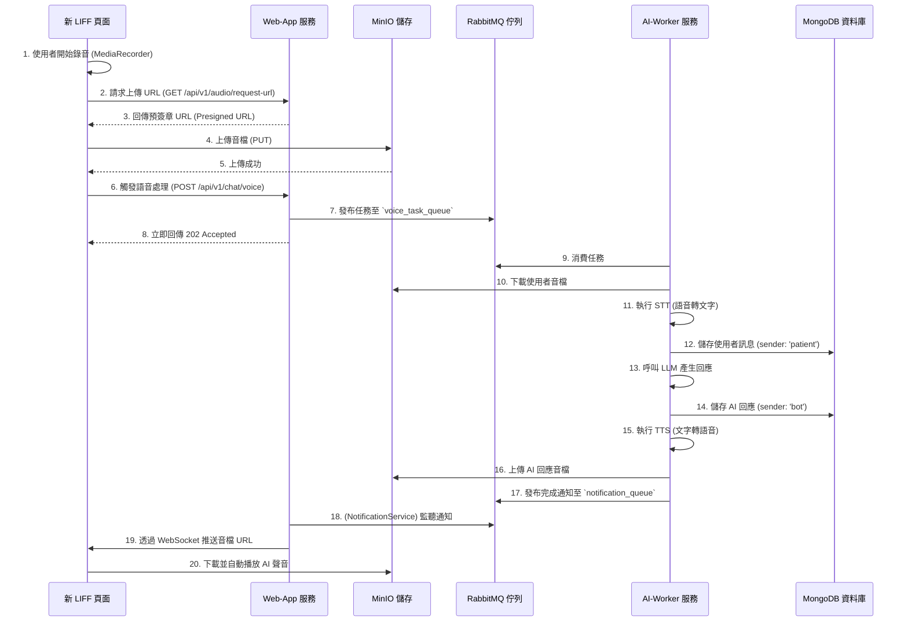

# 開發建議書：即時語音對談 LIFF 頁面 (`voice_chat.md`)

本文檔旨在為「即時語音對談 LIFF 頁面」功能提供一個全面的技術架構、設計模式與開發流程規劃。

---

## 1. 總體架構與資料流

此功能的核心是實現一個非同步、事件驅動的架構，確保前端操作的流暢性與後端處理的可靠性。

### 1.1 系統組件

- **新 LIFF 頁面**: 使用者互動介面，負責錄音與播放。
- **Web-App**: 核心後端，負責處理 HTTP 請求、任務分發與即時通知。
- **MinIO**: 物件儲存，用於存放使用者上傳的原始音檔和 AI 生成的回應音檔。
- **RabbitMQ**: 訊息佇列，作為 `Web-App` 與 `AI-Worker` 之間非同步通訊的中樞。
- **AI-Worker**: 背景處理服務，執行 STT、LLM、TTS 等耗時的 AI 任務。
- **MongoDB**: 對話資料庫，儲存所有文字對話紀錄。

### 1.2 資料流向圖

---

## 2. 層級結構與檔案職責

### 2.1 Web-App 服務

#### **前端層**

- **新增檔案**: `services/web-app/app/static/voice_chat.html`
- **職責**:
  - **UI**: 提供錄音按鈕、對話紀錄顯示區、狀態提示（如：錄音中、處理中）。
  - **錄音**: 使用 `MediaRecorder` API 錄製音訊。
  - **API 呼叫**:
    1.  呼叫 `/audio/request-url` 取得上傳 URL。
    2.  上傳音檔至 MinIO。
    3.  呼叫 `/chat/voice` 觸發後端處理。
  - **即時通訊**: 初始化 `Socket.IO` 客戶端，加入特定房間 (e.g., `socket.emit('join', { 'room': patient_id })`)，並監聽後端推送的 AI 回應事件。

#### **API 層**

- **修改檔案**: `services/web-app/app/api/chat.py`
- **職責**:
  - **新增端點**: `POST /api/v1/chat/voice`。
  - **輸入驗證**: 檢查請求是否包含 `patient_id` 和 `object_name`。
  - **職責轉發**: 呼叫新建立的 `ChatService` 來處理業務邏輯。

#### **服務層 (Core)**

- **新增檔案**: `services/web-app/app/core/chat_service.py`
- **職責**:

  - **業務邏輯協調**: 封裝發起語音聊天任務的邏輯。
  - **方法**: `start_voice_processing_task(patient_id, object_name)`。
  - **動作**: 組合任務訊息，並呼叫 `rabbitmq_service` 將其發布到指定的佇列。

- **修改檔案**: `services/web-app/app/core/notification_service.py`
- **職責**:
  - **通用通知處理**: 監聽 `notification_queue`。
  - **事件廣播**:
    - `message_callback` 應能解析來自 AI-Worker 的不同事件類型。
    - 對於 `'voice_reply'` 事件，它會解析出 `patient_id` 和 `audio_url`。
    - **關鍵**: 使用 `socketio.emit()` 將事件推送到指定 `patient_id` 對應的房間 (`room=patient_id`)。

### 2.2 AI-Worker 服務

- **職責**: 執行所有耗時的 AI 處理。
- **修改檔案**: `services/ai-worker/worker/main.py` (或類似的消費者主程式)
  - 監聽 `voice_task_queue`。
  - 根據收到的任務，依序呼叫 `stt_service`, `llm_service`, `tts_service`。
  - 與 `MinIO` 和 `MongoDB` 進行互動。
  - 任務完成後，組織通知訊息（包含 `event_type: 'voice_reply'`, `patient_id`, `audio_url`）並發布到 `notification_queue`。

---

## 3. 設計模式與原則

- **單一功能原則 (SRP)**:
  - 建立 `ChatService` 專門處理聊天業務邏輯，避免 `NotificationService` 的職責膨脹。
  - `api/chat.py` 只負責 HTTP 介面，不含業務邏輯。
- **非同步處理與解耦**:
  - **RabbitMQ** 作為中介，完全解耦了 `Web-App` 和 `AI-Worker`。即使 AI 處理失敗或緩慢，也不會影響 `Web-App` 的回應速度和穩定性。
- **觀察者模式**:
  - `NotificationService` 作為**發布者**，監聽 RabbitMQ 的事件。
  - 前端 LIFF 頁面作為**訂閱者**，透過 WebSocket 監聽來自 `NotificationService` 的廣播。

---

## 4. 開發流程與關鍵事項

### 4.1 建議開發流程

1.  **環境準備**: 在 RabbitMQ 中建立 `voice_task_queue`。
2.  **API 與服務層骨架**:
    - 建立 `chat_service.py` 及 `start_voice_processing_task` 方法。
    - 在 `chat.py` 中新增 `/chat/voice` 端點，並讓它呼叫 `ChatService`。
3.  **前端基礎功能**:
    - 建立 `voice_chat.html`，實現錄音、上傳至 MinIO、呼叫新 API 的完整流程。
4.  **AI-Worker 核心實現**:
    - 開發 `AI-Worker` 消費 `voice_task_queue` 的邏輯。
    - **分步整合**: 先完成 STT -> 儲存 -> 通知，確認文字紀錄可正常儲存。再逐步加入 LLM 和 TTS。
5.  **即時通知閉環**:
    - 調整 `NotificationService` 以處理 `'voice_reply'` 通知。
    - 實現前端 `Socket.IO` 客戶端接收並播放音訊。
6.  **整合測試**: 進行端到端的完整功能測試。

### 4.2 關鍵技術事項

- **WebSocket 房間管理**:
  - 前端客戶端連接後，應立即發送一個 `join` 事件，將自己加入以 `patient_id` 命名的房間。
  - 後端 `NotificationService` 必須使用 `socketio.emit(event, data, room=patient_id)` 的方式進行定向推送，避免廣播給所有使用者。
- **錯誤處理**:
  - AI-Worker 的處理流程中任何一步失敗（如 STT 無法辨識），都應該向 `notification_queue` 發送一個失敗通知（如 `event_type: 'voice_process_failed'`），讓前端能給予使用者明確的錯誤提示。
- **安全性**:
  - 確保新的 `/chat/voice` API 端點受到 `@jwt_required()` 或等效機制的保護。
- **設定檔管理**:
  - 將 RabbitMQ 的佇列名稱、AI 服務的 API Key 等資訊寫入設定檔或環境變數，方便管理。
