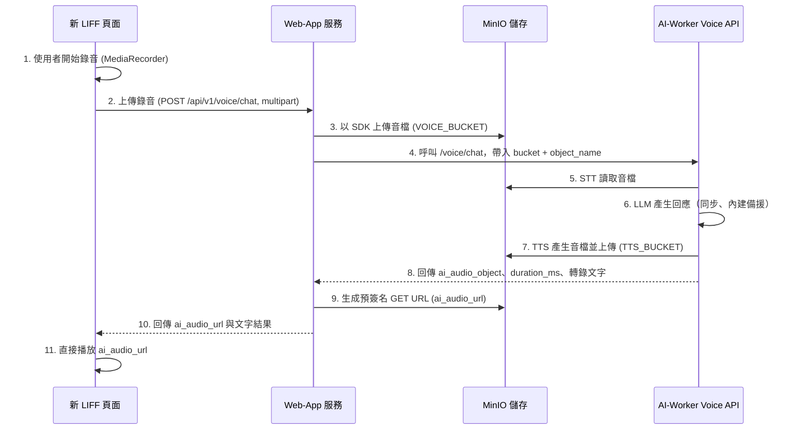
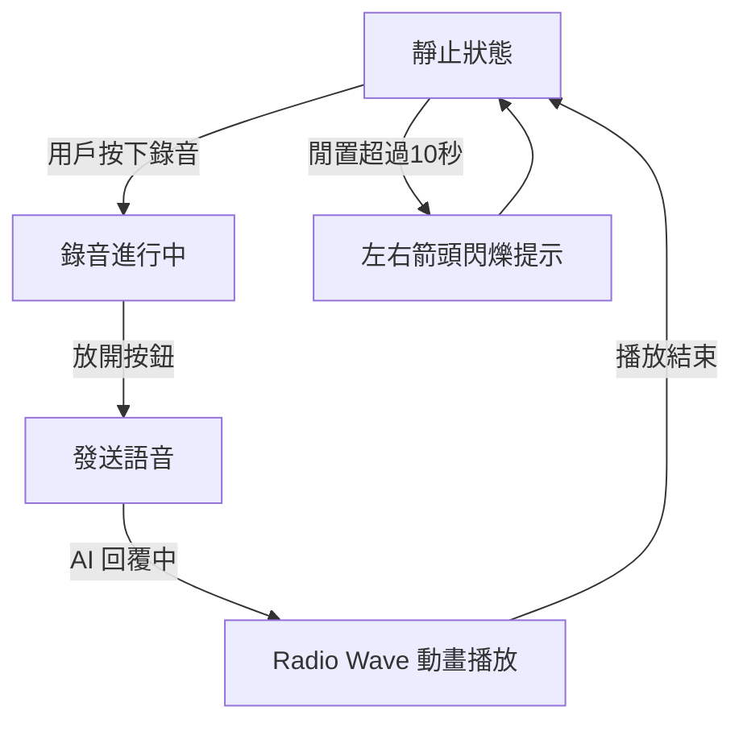

# 開發建議書：即時語音對談 LIFF 頁面 (`voice_chat.md`)

本文檔更新為與目前程式碼完全一致的版本，聚焦於「同步 HTTP 流程」的語音對談（`/api/v1/voice/*`）路徑，並保留後續可擴展至非同步推播的建議。

---

## 1. 總體架構與資料流

目前上線實作以「同步 HTTP」為核心：前端將錄音以 multipart POST 送至 `Web-App` 的 `/api/v1/voice/chat`，`Web-App` 先把檔案上傳至 MinIO，再以 HTTP 呼叫 `AI-Worker Voice Flask API` 完成 STT→LLM→TTS，最後 `Web-App` 生成預簽名 GET URL 回傳給前端播放。此路徑不依賴 RabbitMQ 與 WebSocket。

### 1.1 系統組件

- **新 LIFF 頁面**: 使用者互動介面，負責錄音、呼叫 `/api/v1/voice/chat`、播放回傳之音檔。
- **Web-App（services/web-app）**: HTTP API 網關，處理上傳音檔到 MinIO，並以 HTTP 呼叫 **AI-Worker Voice Flask API**。
- **MinIO**: 物件儲存，存放上傳音檔（`VOICE_BUCKET`）與 TTS 產生檔（`TTS_BUCKET`）。
- **AI-Worker Voice Flask API（services/ai-worker/worker/voice_app/voice_flask_app.py）**: 同步執行 STT→LLM→TTS。TTS 會將音檔上傳回 MinIO，API 回傳物件名稱與時長。
- （可選）**RabbitMQ**: 目前語音 HTTP 路徑未使用；`chat.py` 之文字/音檔佇列任務仍使用 `task_queue`，另有可選的 `voice_worker` 佇列模式供後續擴展。
- （可選）**WebSocket/Socket.IO**: 目前語音 HTTP 路徑未使用；`notification_service` 仍存在以支援其他模組的即時通知。

### 1.2 資料流向圖（目前實作：同步 HTTP 路徑）



---

## 2. 層級結構與檔案職責

### 2.1 Web-App 服務

#### 前端層

- 檔案: `services/web-app/app/static/voice_chat.html`
 - 職責:
  - UI 與錄音：`MediaRecorder` 錄音。在 Radio Wave 上方以「Overlay 文字」呈現狀態與回覆，不使用聊天泡泡。
  - 呼叫 API：以 multipart 直接呼叫 `POST /api/v1/voice/chat`，不經由預簽名上傳。
  - 顯示邏輯：
    - 請求期間顯示 loading 動畫（取代「辨識中」純文字）。
    - 回應抵達後在 Overlay 逐字顯示 `ai_response_text`，同時播放 `ai_audio_url`。
  - 目前頁面未接入 WebSocket；即時性由同步回應與視覺效果（Overlay 逐字 + Radio Wave 動畫）提供體感。

#### API 層（Voice）

- 檔案: `services/web-app/app/api/voice.py`
- 端點與流程（皆為同步 HTTP）：
  - `POST /api/v1/voice/transcribe`：接檔→上傳 MinIO→呼叫 AI-Worker `/voice/stt`→回傳轉錄文字。
  - `POST /api/v1/voice/synthesize`：接文字→呼叫 AI-Worker `/voice/tts`→產生物件→回傳預簽名 GET URL。
  - `POST /api/v1/voice/chat`：接檔→上傳 MinIO→呼叫 AI-Worker `/voice/chat`→取得 TTS 物件→生成預簽名 GET URL→回傳。

#### API 層（Chat, 另一路徑）

- 檔案: `services/web-app/app/api/chat.py`
- 用途：文字聊天與（已上傳）音檔任務的佇列發布，使用 `RabbitMQ task_queue`。此路徑與本頁的 Voice HTTP 路徑相互獨立。

#### 服務層（Core）

- MinIO 服務：`app/core/minio_service.py` 生成預簽名 URL 與檔案操作。
- RabbitMQ 服務：`app/core/rabbitmq_service.py`（供 `chat.py` 之任務發布；本 Voice HTTP 路徑不直接使用）。
- 通知服務：`app/core/notification_service.py`（支援其他模組的推播；Voice HTTP 路徑目前不依賴）。

### 2.2 AI-Worker 服務

- Voice Flask API：`services/ai-worker/worker/voice_app/voice_flask_app.py`
  - 端點：`/voice/stt`、`/voice/tts`、`/voice/chat`。
  - 邏輯：同步流程呼叫 STT/LLM/TTS；TTS 會將音檔上傳至 MinIO，API 回傳物件名稱與時長等資訊。
- Voice Worker（可選）：`voice_worker.py` 提供 RabbitMQ 版處理流程，供未來切換到佇列模式時使用。現行 Web-App 的 Voice HTTP 路徑並未使用它。

---

## 3. 設計模式與原則

- **同步管線，簡化閉環（MVP）**：前端一次請求完成 STT→LLM→TTS，降低整體複雜度與失配可能。
- **物件儲存解耦**：以 MinIO 作為二進位媒介，HTTP API 僅交換物件名稱/URL，避免大檔穿透與壓力。
- **預簽名存取**：對外僅提供預簽名 GET URL，權限與時效可控。
- **可擴展至非同步**：若需進一步降低協同延遲或支援流式事件，後續可切換 `voice_worker` + `notification_service`（RabbitMQ + Socket.IO）模式，但不影響現行同步路徑。

---

## 4. 開發流程與關鍵事項

### 設計框架

#### 功能定位

* 主要用途：使用者按住錄音鍵，將語音送到 `/api/v1/voice/chat` 同步取得 AI 回覆文字與可播放之 TTS 音檔 URL。
* 互動方式：
  1. 回應等待期間顯示「loading 動畫」於 Radio Wave 上方 Overlay。
  2. 回應到達後，在 Overlay 逐字顯示 `ai_response_text` 並播放 `ai_audio_url`。

---

#### **視覺元素細節**

##### (A) 背景

* 顏色：柔和漸層（左上淺藍 #D7ECF5 → 右下粉紫 #C1B8E6 與藍紫 #6DA9E4 混合）
* 質感：柔霧 + 細緻噪點（類似噴砂玻璃效果）

##### (B) 中央 **Radio Wave 圓圈**

* **靜態狀態**：白色實心圓，外圈三層半透明漸層圓環（由內而外：淺藍 #A3D5E7 → 淡青 #B8E2E1 → 更淡青色）
* **動態狀態**：根據 AI 語音音量擴散脈動（呼吸感動畫，放大縮小 5–15%）
* **動態透明度**：外圈波紋 alpha 由 0.6 → 0.0 漸隱
* **動畫速度**：每秒 1.5 次擴散（隨音量自適應）

##### (C) 錄音按鈕（Glassmorphic Style）

* **形狀**：圓形（直徑約螢幕寬度 15%）
* **顏色**：半透明淺藍玻璃感背景
* **特效**：毛玻璃（blur: 12px），邊緣白色光暈
* **Icon**：白色麥克風圖示，大小佔按鈕 50%
* **文字標籤**：下方「按住說話」#6D9BC3，字重 500

##### (D) 閒置提示箭頭

* **位置**：錄音按鈕左右各一個
* **樣式**：細白色箭頭（透明度 0.6），指向錄音按鈕
* **動畫**：0.8s 緩入緩出（左右交替閃爍）

##### (E) 頂部提示文字

* **內容**：「今天想跟艾莉分享什麼呢？」
* **字體**：柔和圓角無襯線
* **顏色**：粉紫 #A6A0E8
* **字重**：600
* **對齊**：置中

---

#### 互動流程（UI State Flow）



---

#### 動效需求

| 元素         | 動效類型       | 觸發條件     | 動畫參數                             |
| ---------- | ---------- | -------- | -------------------------------- |
| Radio Wave | 擴散波紋 + 呼吸感 | AI 語音回覆中 | 擴散範圍 100%→130%，透明度 0.6→0，1.5s 週期 |
| 錄音按鈕       | 按壓縮放       | 用戶按住     | 縮放 100%→95%，陰影加深                 |
| 閒置提示箭頭     | 閃爍交替       | 閒置 >10s  | alpha 0.6→0，0.8s 緩入緩出            |
| 背景漸層       | 固定漸層       | 全時       | 靜態，不變動                           |

---


### 4.1 建議開發流程（對應現況，確保可用的 MVP）

1. 環境與設定
   - 確認 `AI_WORKER_VOICE_URL`（預設 `http://ai-worker:8001`）可達。
   - 在 MinIO 中準備 `VOICE_BUCKET` 與 `TTS_BUCKET`（程式會自動建立缺失的 bucket）。
2. API 與頁面
   - 前端 `voice_chat.html` 使用 `POST /api/v1/voice/chat`（multipart）傳送音檔。
   - `voice.py` 上傳音檔至 MinIO（`VOICE_BUCKET`），呼叫 AI-Worker `/voice/chat`，取得 `ai_audio_object` 後生成預簽名 GET URL 回傳。
3. 整合測試
   - 以短音檔驗證端到端流程（錄音→TTS 回放）。
4.（可選）最佳化
   - 錄音用 `audio/webm;codecs=opus` 以縮小檔案，縮短上傳時間（瀏覽器支援時）。
   - LLM/STT/TTS 服務 warm-up（在 AI-Worker 啟動時預載）。

備註：若未來要引入非同步推播（分段狀態如 STT 完成、LLM 完成、TTS 完成），可改走 `voice_worker` + `notification_service`，前端再接入 Socket.IO；不影響現行同步 HTTP 路徑。

### 4.2 關鍵技術事項

- **路徑與存取一致性**：本頁面語音對談走 `/api/v1/voice/*` 同步 HTTP 路徑；`chat.py` 的佇列任務屬於另一個模組，不混用。
- **MinIO 使用**：
  - 輸入：`voice.py` 代表後端代上傳至 MinIO（非前端直傳）。
  - 輸出：AI-Worker TTS 上傳至 MinIO，`voice.py` 回應預簽名 GET URL。
- **格式與大小限制**（與程式一致）：
  - 允許副檔名：`wav, mp3, m4a, ogg, webm`；最大 16MB。
- **錯誤處理**：`voice.py` 與 `voice_flask_app.py` 對下游失敗有降級回應；前端應顯示明確錯誤提示並允許重試。
- **安全性**：目前 `voice.py` 未加 `@jwt_required()`；如需保護，可後續補上並在前端帶 Token。

（可選擴展）
- **非同步推播**：導入 `voice_worker` + `notification_service`，前端接入 Socket.IO 以獲取分段事件，提升體感即時性。

---

### 4.3 MVP 擴展：逐字出字（SSE）與自動播放策略（iOS/LINE）

為達成「Radio Wave 上方即時逐字出字」且保持部署簡單，建議以 SSE（Server-Sent Events）做單向推送。僅在需要雙向控制/房間定向時再升級 Socket.IO。

#### 為何選 SSE（而非立刻導入 Socket.IO）
- 單向逐字推送即可滿足需求，SSE 實作與運維較簡單。
- 若未來需要定向推送（room=patient_id）、雙向控制（中止合成等），再導入 Socket.IO。

#### 擴展 API（建議新增，保持與現有同步路徑相容）
- `POST /api/v1/voice/chat/async`：
  - 前端上傳音檔 → 立即回傳 `job_id`（202）。
  - 後端觸發 AI 處理流程。
- `GET /api/v1/voice/stream?job_id=...`（SSE）：
  - 事件型式：
    - `stt_partial`：{ text }
    - `stt_final`：{ text }
    - `llm_token`：{ token }
    - `llm_done`：{ text }
    - `tts_ready`：{ ai_audio_url, duration_ms }
- `POST /api/v1/voice/events`：
  - AI-Worker 回推上述事件，Web-App 依 `job_id` 寫入對應事件佇列，由 SSE 端持續吐出。

（MVP 可用 in-memory 佇列；之後可換 Redis Pub/Sub 或 RabbitMQ → WebSocket）

#### 前端（`voice_chat.html`）調整要點
- 在 Radio Wave 上方加入 Overlay 容器與 CSS loading 動畫。
- 流程：
  1. 停止錄音後，呼叫 `/voice/chat/async` 取得 `job_id`，顯示 loading 動畫。
  2. 建立 `EventSource('/api/v1/voice/stream?job_id=...')`，依事件：
     - `stt_partial/final`：覆蓋 Overlay 文字。
     - `llm_token`：疊加 token 形成逐字效果。
     - `tts_ready`：嘗試播放音檔；成功則持續 Radio Wave 呼吸動畫。

簡化事件處理（示意）：
```
es.addEventListener('stt_partial', e => setOverlay(JSON.parse(e.data).text))
es.addEventListener('llm_token',   e => appendOverlay(JSON.parse(e.data).token))
es.addEventListener('tts_ready',   async e => {
  const { ai_audio_url } = JSON.parse(e.data)
  try { await safePlay(ai_audio_url) } catch { showTapToPlayHint() }
})
```

#### iOS/LINE 自動播放策略與風險評估
- 自動播放限制來自瀏覽器/容器（Safari/LINE WebView），與 AI 核心（Breeze ASR 25、LLM&RAG、OrpheusTTS）無直接衝突，但「非使用者手勢觸發的播放」可能被拒。
- 建議：
  - 使用者開始錄音的手勢時：
    - 建立或解鎖 `AudioContext`（WebAudio unlock）。
    - 預先以同一 `Audio` 元素播放極短靜音並立即 `pause()`，解鎖後續 `play()`。
    - `<audio playsinline>` 避免自動全螢幕。
  - 當 `tts_ready` 抵達：
    - 優先使用已解鎖的 `Audio` 元素 `src = ai_audio_url; play()`。
    - 若被拒，顯示「點一下播放」的輕量提示（覆蓋在 Radio Wave 上）。
  - 確保 MinIO 物件內容型別與 CORS 正確，避免跨域或解碼問題。

#### AI-Worker 擴展要點
- STT（Breeze ASR 25）：如支援流式/partial，事件回推 `stt_partial/stt_final`；若不支援，可定期將暫得文字切片推送，模擬逐字效果。
- LLM&RAG：如支援 token streaming，邊生成邊回推 `llm_token`；否則將完成文字分塊模擬。
- TTS（OrpheusTTS）：若非流式，完成即回 `tts_ready`；若支援 HLS/分段，前端可無縫提早播放開頭片段（進階版）。
